# Welcome to the new and improved CompsciBot!

## Conventions

- Please create and commit work into a new branch, instead of directly into main.
- Use a consistent, clear code structure
- Comment when needed

## Getting started

This is a tutorial for new developers who have never made or setup a discord bot
before.

### Prior Knowledge:

This tutorial assumes you have a basic understanding of GitHub, and python. It also assumes you have git, python, and pip package manager installed on your computer.

If you do not have this skill yet, we recommend you check out:

- [An Intro to Git and GitHub for Beginners](https://product.hubspot.com/blog/git-and-github-tutorial-for-beginners)
- [Python for Beginners](https://www.python.org/about/gettingstarted/)
- [IDEs and Text Editors](https://www.pythondiscord.com/resources/tools/)

**Note:** we will be using Visual Studio Code in this tutorial

### 1. Getting the Code

First things first, we will need to clone the main GitHub to our local repository.

One way to do this is to paste this code in terminal, where you want the files to go:

```pwsh
git clone https://github.com/EMU-Compsci-Discord/CompsciBot
```

You should see something similar to this result if you are using Windows Command Prompt, but the command will work on Mac and Linux aswell.

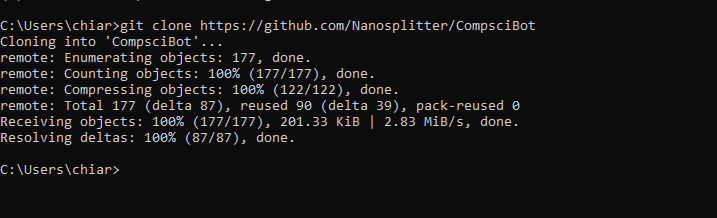

You can set up a python virtual environment that uses python 3.9 by running this command on windows

```pwsh
&"C:\Program Files\Python39\python.exe" -m venv .venv
```

### 2. Getting a Discord Bot

Now that you have the code base, you need to add a bot to discord to test any new code you add.

Go to the application tab of the [Discord Developer Portal](https://discord.com/developers/applications)

You should see an interface like this one:
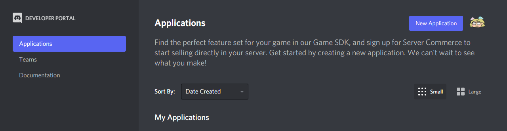

Click on "New Application" in the top right.

You will be prompted to give it a name, we suggest using "CompsciBot - [your name]".

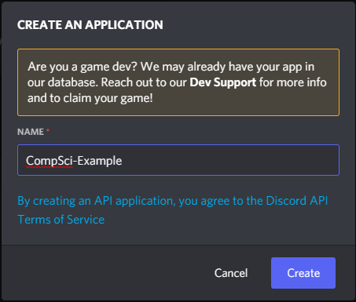

You will then be taken to the bots General information. Note the **APPLICATION ID**, as its important for later.

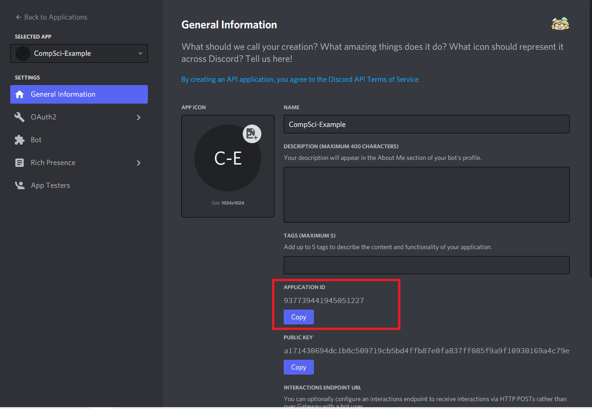

### 3. Adding a Bot

Now that you have an application, you need the actual bot.

Click on the Bot tab in the sidebar to see this:

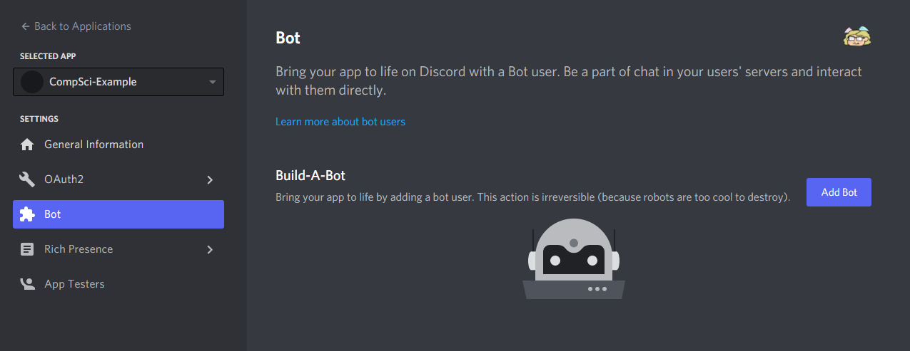

Click "Add Bot". The page will ask if you are sure, click "Yes do it!".

Now you will see a Bot Screen, with the default discord logo and name.

Notice the **TOKEN** section of the page, as we will use that in the next step.
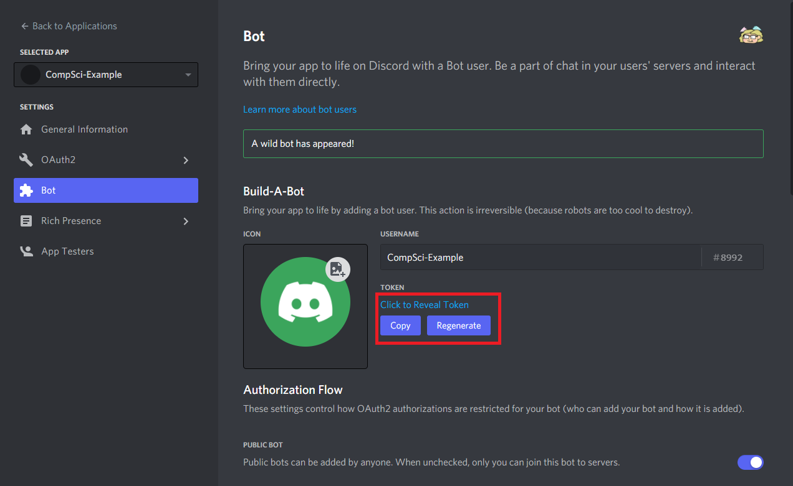

### 4. Bot Permissions

In the Bot page, Scroll down and find **Bot Permissions**

Click the Administrator Box, so it looks as shown:
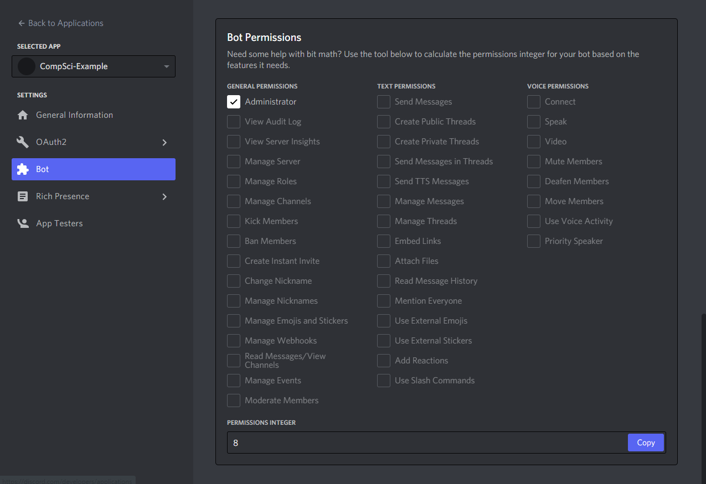

### 4. Config File

Now go to your IDE or Text Editor, and make a copy of `config template.yaml`. Save the copy as `config.yaml`. This will be the bots config file, and is important to running on discord.

DO NOT WRITE ON THE TEMPLATE

```yaml
token: "BOT_TOKEN"
application_id: "APPLICATION_ID"
owners:
  - OWNER_ID
blacklist:
  - 000000000000000000
main_color: 0xD75BF4
error: 0xE02B2B
success: 0x42F56C
warning: 0xF59E42
info: 0x4299F5
```

On the `config.yaml` file, you will be changing four lines:

- `token`
- `application_id`
- `owner_id`

`token` and `application_id` you have seen earlier <a href="#token">here</a> and <a href="#appId">here</a> on the Developer Portal. Copy and Paste those into the quotations to replace BOT_TOKEN and APPLICATION_ID.

**Generally, avoid using a character another bot uses, as it will call both bots.**

`owner_id` is a bit trickier.

- If you DO NOT have Discord Developer Mode enabled, go to Settings>Advanced, and enable Developer Mode

- If you have Discord Developer Mode turned ON, right click on Settings, and click on the dots next to your name.

If you get stuck on this step, [here is a good reference to help](https://www.alphr.com/discord-find-user-id/).

When you are done getting all of these filled in, your config should be ready to use.

### 5. Create an Invite Link

Back in the Developer Portal, go to **OAuth2 > URL Generator** and check the `[ ] bot` checkbox. This will show a second set of options called **Bot Permissions**

In bot permissions, check the `[ ] Administrator` checkbox and scroll to the bottom to get an invite link.

The result should look like this below:
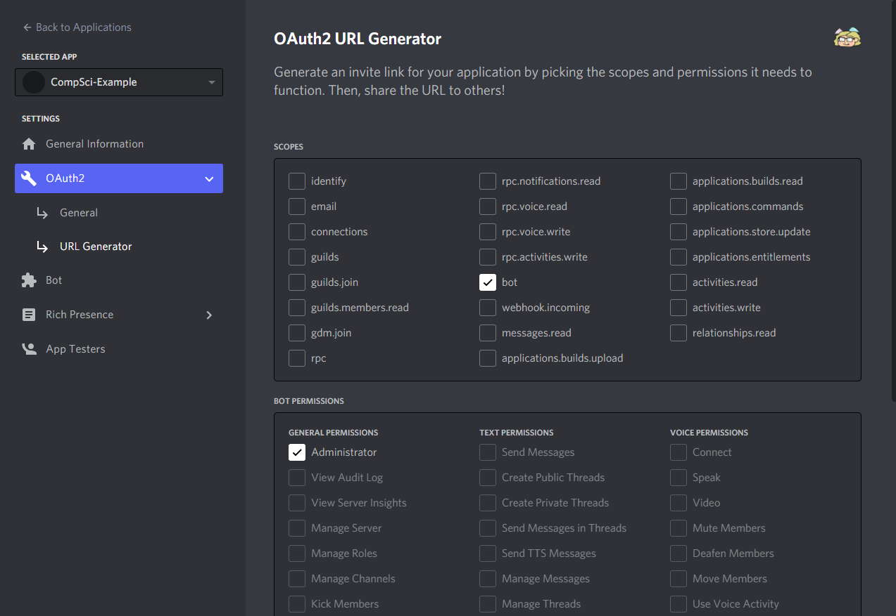

### 6. Join the Testing Server and Add the bot.

First, join the **[Compsci Bot Testing Server](https://discord.gg/M48HYYYCyT)** if you havent already.

You will need the @developer role. Ask a developer or @Nanosplitter or @chiara5576 and we will give permissions to add your bot.

Next open the url from step 5 in a browser.

Select "Compsci Bot Testing" then click "Continue", Make sure "Administrator" is checked, then click "Authorize".

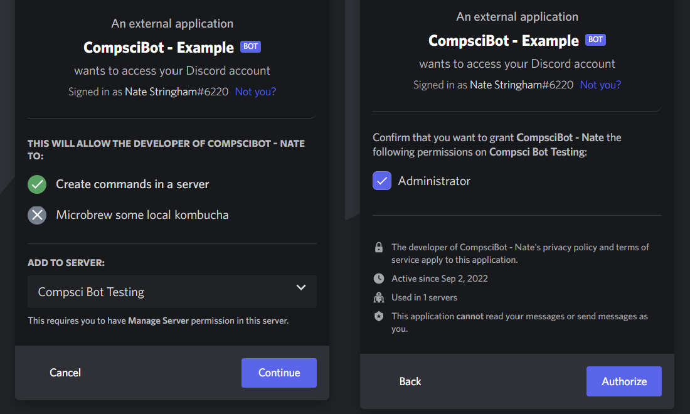

Now it should show on the server side panel, but it is not shown as being on.

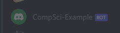

### 7. Running your bot

You are almost done! Now for the coding part.

First, we will need to install all of the dependencies in the `requirements.txt` file.

If you're using a virtual environment, make sure it is activated.

Then run this command in the terminal:

```pwsh
pip install -r requirements.txt
```

This will download all of the dependencies needed for the bot.

Note: the requirements.txt may not download everything. If it misses something, `pip install <module>` directly, or ask for help in the server for a direct link.

Once installed, to run your bot, simply type:

```pwsh
python bot.py
```

This will run your bot!

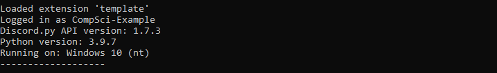

You will now see your bot in the ONLINE category, and if you call it with a `/ping` command it will respond.

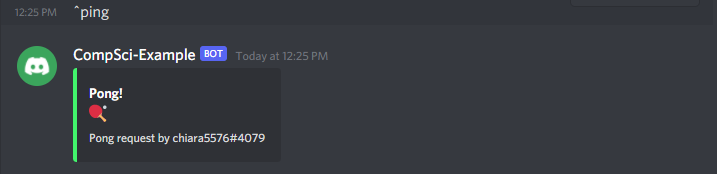

press <kbd>Ctrl</kbd>+<kbd>C</kbd> to stop the bot from running, and now you can work on and change the bot as needed!
