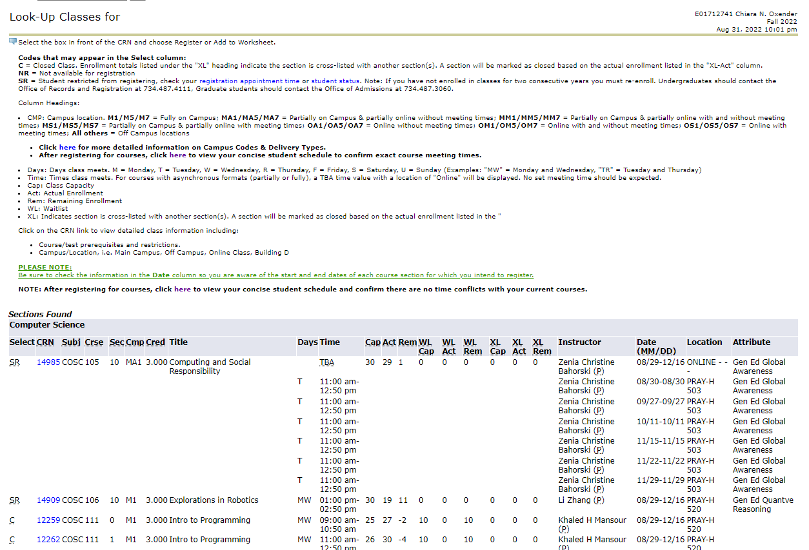
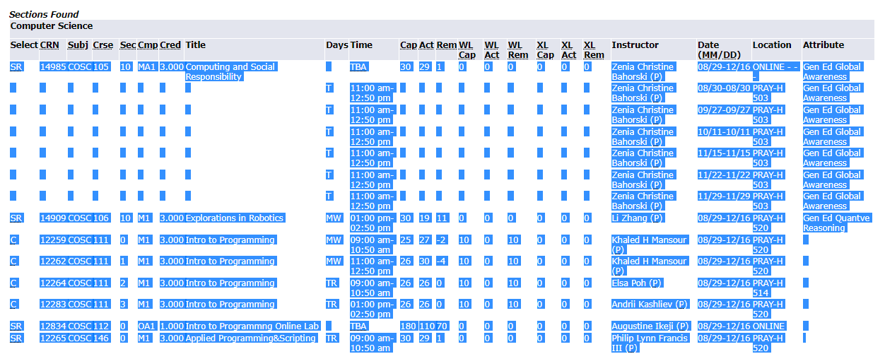

# Creating Channels with CompSciBot

- [Creating Semester Channels](#creating-semester-channels)
- [Removing Semester Channels](#removing-semester-channels)

---

## Creating Semester Channels

To create the semester channels, first you need to get the csv of the classes for the semester.

There are many ways to do this, but keep in mind the csv is parse by order, not by column name (for example, the fourth column is always the class number).

### Getting the csv

1. **Log into** the [EMU registration portal](https://bannerweb.emich.edu/pls/banner/twbkwbis.P_GenMenu?name=bmenu.P_RegMnu) and go into Student Services > Registration > Look-up Classes > [Select Semester] > Advanced Search
1. **Select** Subject:"Computer Science"
   

1. **Highlight** the classes (not the columns or headers) and copy it.
   

1. **Paste into an excel sheet** the values, so each column is in a cell (may need to paste with merge format).1. Save the excel sheet as .csv file

   - Repeat steps 1-4 into the same excel spreadsheet for any math or stats classes desired (such as STATS360)

1. **Commit to a new branch** under `./resources`, and merge it to GitHub main branch. Then ask to restart the bot (it is jank but bear with me).

### Commands

Then a user with **admin permissions** will be able to use the commands provided in the bot:

    ```
    !csvparse [file_name]
    ```

**Note:** The file must be a csv, and it cannot have any special characters besides forward slash, dash and underscore.

This will create all of the channels, and the roles corresponding to them. The channels have format `cosc-###-proflastname` and the categories have format `COSC-###`.

This command also creates a role with the structure `COSC ### Semester Year`

We recommend you use carlbot to create a reaction role message. See [Carl-bot docs](https://docs.carl.gg/roles/reaction-roles/) for details.

## Removing Semester Channels

After the channels are ready to be removed at the end of the semester, a user with **admin permissions** can execute the following:

```
!deleteclasses
!deleteclassroles
```

`!deleteclasses` will delete all channels containing a substring `(COSC/STAT/MATH)-###`.

`!deleteclassroles` will delete all roles with containing a substring `(COSC/STAT/MATH) ###`.

**WARNING!** There is no way to get them back after doing this, so use this command carefully.
